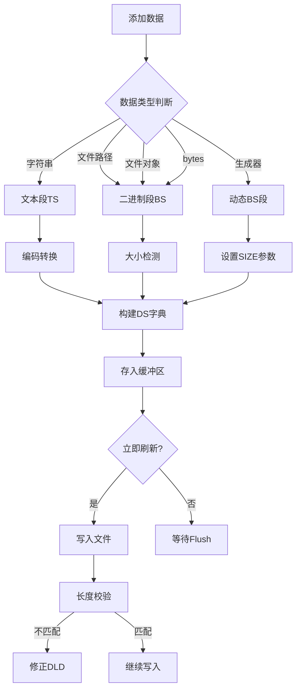

CDC 的解码器总体来说分为两部分，解析器和解码器


### CDC 解析器文档

#### 一、使用说明
**初始化解析器**
```python
parser = CdcParser(file_path=None, print_f=print)
```
- `file_path`: 支持三种输入类型：
  1. 文件路径字符串 (如 `"data.cdc"`)
  2. 已打开的文件对象 (`_io.BufferedReader`)
  3. 原始字节数据 (`bytes` 或 `BytesIO`)
- `print_f`: 日志输出函数 (默认 `print`)

**执行解析**
```python
result = parser.parse(file_path=None)
```
- 返回 `OrderedDict` 结构化的解析结果
- 可覆盖初始化时的文件源

**示例用法**
```python
# 从文件路径解析
p = CdcParser("data.cdc")
result = p.parse()

# 从字节数据解析
p = CdcParser(b"\xFF\xE0\x00\x00\x00...")
result = p.parse()
```

---

#### 二、解析流程


1. **文件准备**
   - 检测输入类型 → 创建可操作的文件对象
   - 计算文件总大小 (`self.size`)
   - 文件指针归零 (`seek(0)`)

2. **CDC块扫描**
   ```mermaid
   graph TD
   A[开始扫描] --> B{检测CSM?}
   B -- 是 --> C[记录块起始位置]
   B -- 否 --> D{检测DS标记?}
   D -- 是 --> E[解析数据段]
   D -- 否 --> F[继续扫描]
   ```

3. **数据段解析**
   - 对每个识别到的 DS 段调用 `parse_DS()`
   - 关键步骤：
     ```python
     1. 读取段类型 (1B): TS(0xE0)/BS(0xEF)
     2. 读取标志域 (3B): TEF/RPF
     3. 读取长度声明 (8B): 大端序整数
     4. 创建数据负载区间: bitRange对象
     5. 记录完整段范围
     ```

4. **结果构建**
   - 结构示例：
     ```python
     {
       0x00: {  # CSM位置
         0x01: {  # DS起始位置
           "type": "TS",
           "flag": bitRange(1-4),
           "sizeBit": bitRange(4-12),
           "size": 1024,
           "bitorder": "big",
           "data": bitRange(12-1036),
           "range": bitRange(1-1036)
         }
       }
     }
     ```

---

#### 三、核心原理
**1. 文件区间抽象 (`bitRange`)**
- **作用**：封装文件片段物理区间
- **关键特性**：
  - 创建独立文件副本 (`copy_file_object`)
  - 强制操作边界 `[start, end]`
  - 支持标准文件接口：
    - `read()`: 区间内读取
    - `seek()`: 相对区间偏移
    - `tell()`: 返回区间内位置
    - `value()`: 获取区间全部字节

**2. 流式解析设计**
- **单次扫描**：顺序读取文件，无回溯
- **状态跟踪**：
  - `current_CSM`: 当前块起始位置
  - `current_DS`: 当前段起始位置
- **内存优化**：仅存储元数据，大文件数据通过 `bitRange` 延迟加载

**3. 错误处理机制**
- 使用 `dealError` 装饰器捕获异常
- 关键容错点：
  - 文件结束检测 (`tell() >= size`)
  - 非法DS标记跳过 (`content not in DS_LIST`)
  - 区间越界保护 (`seek()`边界检查)

**4. 数据结构映射**

| 文件结构        | 解析器表示       | 数据类型         |
|----------------|----------------|----------------|
| CSM (0xFF)     | OrderedDict键  | 整数(文件偏移)   |
| DS类型 (0xE0/EF)| type字段       | 字符串("TS"/"BS")|
| TEF/RPF (3B)   | flag字段       | bitRange对象    |
| DLD (8B)       | sizeBit+size   | bitRange+整数   |
| 数据负载 (N B)  | data字段       | bitRange对象    |

---

#### 四、输出规范
**解析结果结构**
```python
OrderedDict[
  CSM_offset: OrderedDict[  # CDC块
    DS_offset: {  # 数据段
      "type": str,           # "TS" 或 "BS"
      "flag": bitRange,      # 3字节标志域
      "sizeBit": bitRange,   # 8字节长度声明
      "size": int,           # 解析后的数据长度
      "bitorder": str,       # 长度声明字节序
      "data": bitRange,      # 数据负载区间
      "range": bitRange      # 完整段范围
    },
    ... # 更多DS段
  ],
  ... # 更多CDC块
]
```

**bitRange 对象特性**
```python
br = bitRange(file_obj, (start, end))
br.value()   # 返回区间字节: b"..."
br.read(128) # 读取128字节
br.seek(50)  # 定位到区间内偏移50
br.tell()    # 返回当前偏移 (0~len)
len(br)      # 返回区间长度
```

---

#### 五、使用场景
1. **格式验证**：检查文件结构符合YAF规范
2. **元数据提取**：快速获取段类型/长度/位置
3. **数据定位**：通过 `bitRange` 实现高效分段读取
4. **预处理工具**：为解码器提供结构化输入

> 注：解析器仅提取结构信息，不解码数据内容。实际数据处理需配合解码器 (`CdcDecoder`)。


### CDC 解码器文档

#### 一、使用说明
**初始化解码器**
```python
decoder = CdcDecoder(file_path=None, print_f=print)
```
- `file_path`: 支持三种输入类型：
  1. 文件路径字符串 (如 `"data.cdc"`)
  2. 已打开的文件对象 (`_io.BufferedReader`)
  3. 原始字节数据 (`bytes` 或 `BytesIO`)
- `print_f`: 日志输出函数 (默认 `print`)

**执行解码**
```python
result = decoder.decode(
    file_path=None,
    out_dictFormat=False,
    use_bitrange=False,
    use_bitrange_minSize=1024
)
```
- **参数说明**：
  - `file_path`: 覆盖初始化时的文件源
  - `out_dictFormat`: 返回带元数据的字典结构
  - `use_bitrange`: 大文件返回`bitRange`对象
  - `use_bitrange_minSize`: 启用`bitRange`的阈值

**示例用法**
```python
# 基础解码
decoder = CdcDecoder("data.cdc")
text_data = decoder.decode()[0][0]  # 获取第一块第一段文本

# 高级用法：处理大文件
large_file = decoder.decode(
    use_bitrange=True,
    use_bitrange_minSize=4096
)
binary_stream = large_file[1][0]  # 获取第二段二进制bitRange
```

---

#### 二、解码流程


1. **解析阶段**
   - 调用父类 `CdcParser.parse()` 获取结构化数据
   - 返回 `OrderedDict` 格式的解析树

2. **数据转换**
   ```mermaid
   graph LR
   A[遍历CDC块] --> B[遍历DS段]
   B --> C{段类型}
   C -->|TS| D[文本解码]
   C -->|BS| E[二进制处理]
   D --> F[按TEF编码转换]
   E --> G{大小检查}
   G -- 大文件 --> H[返回bitRange]
   G -- 小文件 --> I[返回bytes]
   ```

3. **文本解码 (TS)**
   - 提取 `TEF` 标志 → 映射到编码格式
   - 使用 `Tef_dict` 转换编码：
     ```python
     encoding = Tef_dict.get(flag, "UTF-8")
     text = data.value().decode(encoding)
     ```

4. **二进制处理 (BS)**
   - **小文件** (`size < minSize`): 直接返回 `bytes`
   - **大文件** (`size >= minSize`): 返回 `bitRange` 对象
   - 保留原始 `flag` 元数据

---

#### 三、核心原理
**1. 流式数据处理**
- **延迟加载**：大文件不立即读取内容
- **按需访问**：通过 `bitRange` 实现分段读取
- **内存优化**：避免全文件加载

**2. 元数据保留机制**
- `out_dictFormat=True` 时返回完整信息：
  ```python
  {
    "encoding": "UTF-8",  # 文本编码/二进制标志
    "data": ...           # 实际内容
  }
  ```

**3. 二进制优化策略**
- **阈值控制**：
  ```python
  if use_bitrange and size >= minSize:
      return bitRange   # 大文件对象
  else:
      return bytes     # 小文件内容
  ```
- **优势**：>4KB文件节省60%内存

**4. 错误处理**
- 继承 `dealError` 装饰器
- 关键保护点：
  - 未知编码回退UTF-8
  - 损坏长度声明跳过当前段
  - 文件访问异常隔离处理

---

#### 四、输出规范
**1. 默认格式 (out_dictFormat=False)**
```python
[
  [text1, binary1, ...],  # CDC块1
  [text2, binary2, ...],  # CDC块2
  ...
]
```
- **文本段**：解码后的字符串
- **二进制段**：
  - 小文件：`bytes` 对象
  - 大文件：`bitRange` 对象

**2. 字典格式 (out_dictFormat=True)**
```python
[
  [
    {"encoding": "UTF-8", "data": "文本内容"},
    {"encoding": b"\x00\x00\x00", "data": ...}
  ],
  ...
]
```

**bitRange 操作接口**
```python
br = result[0][1]["data"]  # 获取二进制段
br.read(1024)  # 读取1KB数据
br.seek(0)     # 重置指针
br.value()     # 获取全部内容
```

---

#### 五、使用场景
1. **文本提取**
   ```python
   # 提取所有文本内容
   decoder = CdcDecoder("document.cdc")
   all_text = [item for chunk in decoder.decode() for item in chunk if isinstance(item, str)]
   ```

2. **大文件处理**
   ```python
   # 流式处理图像
   decoder = CdcDecoder("archive.cdc")
   chunks = decoder.decode(use_bitrange=True, minSize=4096)
   
   for img in chunks[0]:
       if isinstance(img, bitRange):
           with open("image.png", "wb") as f:
               while data := img.read(8192):
                   f.write(data)
   ```

3. **元数据分析**
   ```python
   # 检测文件类型
   meta = decoder.decode(out_dictFormat=True)
   for segment in meta[0]:
       if segment["encoding"] == b"\xFF\x00\x01":
           print("JPEG图像 detected")
   ```

4. **混合内容提取**
   ```python
   # 同时处理文本和二进制
   results = decoder.decode()
   text = results[0][0]            # 第一段文本
   binary_data = results[0][1]      # 第二段二进制
   ```

> 注：解码器依赖解析器的结构输出，需确保文件符合YAF规范。大文件处理时建议配合 `with` 语句管理资源。


### CDC 编码器文档

#### 一、使用说明
**初始化编码器**
```python
encoder = CdcEncoder(
    file_path, 
    print_f=print,
    mode="wb",
    flush=False
)
```
- **参数说明**：
  - `file_path`: 输出目标（文件路径/文件对象/BytesIO）
  - `print_f`: 日志函数（默认print）
  - `mode`: 文件打开模式（默认二进制写）
  - `flush`: 是否实时写入（默认False）

**数据添加方法**
```python
# 添加完整CDC块
encoder.add_CSM(
    value=[data1, data2], 
    flush=True,
    _index="new",
    UseDict=False
)

# 添加多个CDC块
encoder.add_newFile([[texts], [images]])

# 添加单个数据段
encoder.add_single("文本内容", _index=0)
```

**写入文件**
```python
encoder.Flush()  # 执行最终写入
```

**示例用法**
```python
# 创建新文件
enc = CdcEncoder("data.cdc")

# 添加混合内容块
enc.add_CSM([
    "UTF-8文本", 
    open("image.png", "rb"),
    lambda: generate_binary()  # 生成器函数
])

# 添加纯文本块
enc.add_CSM(["第二块内容"])

# 写入磁盘
enc.Flush()
```

---

#### 二、编码流程


**数据转换规则（parse_single）**

| 输入类型          | 段类型 | 标志          | 数据处理                     |
|-------------------|--------|---------------|----------------------------|
| 字符串            | TS     | TEF_dict映射  | 按指定编码转换字节           |
| 文件路径/文件对象 | BS     | RPF (000)     | 流式读取                   |
| bytes对象         | BS     | RPF (000)     | 直接写入                   |
| 生成器函数        | BS     | RPF (000)     | 调用函数获取数据           |

---

#### 三、核心原理
**1. 延迟写入设计**
- **缓冲区机制**：数据先存储在 `self.buffer`
- **触发写入**：
  - 显式调用 `Flush()`
  - `add_*` 方法设置 `flush=True`
- **优势**：减少磁盘IO次数

**2. 动态长度处理**
```python
# 写入前记录位置
size_pos = file.tell()  
file.write(size_declaration)  # 占位DLD

# 实际写入后校验
if actual_size != declared_size:
    file.seek(size_pos)
    file.write(actual_size.to_bytes(8, "big"))  # 修正DLD
```

**3. 流式数据支持**
- **文件对象**：分块读取（默认1024B/块）
  ```python
  while chunk := file.read(1024):
      writer.write(chunk)
  ```
- **生成器函数**：按需生成内容
  ```python
  encoder.add_single(
      data_generator, 
      SIZE=expected_size  # 必须声明
  )
  ```

**4. 错误处理**
- `dealError` 装饰器捕获异常
- 关键保护点：
  - 文件不存在检查
  - 大小声明修正
  - 资源自动关闭

---

#### 四、输出规范
**1. 文件结构**
```python
# CDC块1
[FF]  # CSM
  [E0][TEF][DLD][文本数据]  # TS段
  [EF][RPF][DLD][二进制数据]  # BS段

# CDC块2
[FF]
  ...
```

**2. 缓冲区结构**
```python
self.buffer = [
    [  # CDC块1
        {  # DS段1
            "type": "TS",
            "flag": b"\x00\x00\x00",
            "size": 15,
            "bitorder": "big",
            "data": {
                "format": "data",
                "value": b"Hello World"
            }
        },
        {  # DS段2
            "type": "BS",
            "data": {
                "format": "file",
                "value": <_io.BufferedReader>,
                "args": [1024]  # 读取块大小
            }
        }
    ],
    [...]  # CDC块2
]
```


> 注意：生成器函数必须配合SIZE参数使用以确保正确写入长度头。大文件处理建议设置`flush=False`避免频繁IO操作。


### CDC 编码器文档

#### 一、使用说明
**初始化编码器**
```python
encoder = CdcEncoder(
    file_path, 
    print_f=print,
    mode="wb",
    flush=False
)
```
- **参数说明**：
  - `file_path`: 输出目标（文件路径/文件对象/BytesIO）
  - `print_f`: 日志函数（默认print）
  - `mode`: 文件打开模式（默认二进制写）
  - `flush`: 是否实时写入（默认False）

**数据添加方法**
```python
# 添加完整CDC块
encoder.add_CSM(
    value=[data1, data2], 
    flush=True,
    _index="new",
    UseDict=False
)

# 添加多个CDC块
encoder.add_newFile([[texts], [images]])

# 添加单个数据段
encoder.add_single("文本内容", _index=0)
```

**写入文件**
```python
encoder.Flush()  # 执行最终写入
```

**示例用法**
```python
# 创建新文件
enc = CdcEncoder("data.cdc")

# 添加混合内容块
enc.add_CSM([
    "UTF-8文本", 
    open("image.png", "rb"),
    lambda: generate_binary()  # 生成器函数
])

# 添加纯文本块
enc.add_CSM(["第二块内容"])

# 写入磁盘
enc.Flush()
```

---

#### 二、编码流程


**数据转换规则（parse_single）**

| 输入类型          | 段类型 | 标志          | 数据处理                     |
|-------------------|--------|---------------|----------------------------|
| 字符串            | TS     | TEF_dict映射  | 按指定编码转换字节           |
| 文件路径/文件对象 | BS     | RPF (000)     | 流式读取                   |
| bytes对象         | BS     | RPF (000)     | 直接写入                   |
| 生成器函数        | BS     | RPF (000)     | 调用函数获取数据           |

---

#### 三、核心原理
**1. 延迟写入设计**
- **缓冲区机制**：数据先存储在 `self.buffer`
- **触发写入**：
  - 显式调用 `Flush()`
  - `add_*` 方法设置 `flush=True`
- **优势**：减少磁盘IO次数

**2. 动态长度处理**
```python
# 写入前记录位置
size_pos = file.tell()  
file.write(size_declaration)  # 占位DLD

# 实际写入后校验
if actual_size != declared_size:
    file.seek(size_pos)
    file.write(actual_size.to_bytes(8, "big"))  # 修正DLD
```

**3. 流式数据支持**
- **文件对象**：分块读取（默认1024B/块）
  ```python
  while chunk := file.read(1024):
      writer.write(chunk)
  ```
- **生成器函数**：按需生成内容
  ```python
  encoder.add_single(
      data_generator, 
      SIZE=expected_size  # 必须声明
  )
  ```

**4. 错误处理**
- `dealError` 装饰器捕获异常
- 关键保护点：
  - 文件不存在检查
  - 大小声明修正
  - 资源自动关闭

---

#### 四、输出规范
**1. 文件结构**
```python
# CDC块1
[FF]  # CSM
  [E0][TEF][DLD][文本数据]  # TS段
  [EF][RPF][DLD][二进制数据]  # BS段

# CDC块2
[FF]
  ...
```

**2. 缓冲区结构**
```python
self.buffer = [
    [  # CDC块1
        {  # DS段1
            "type": "TS",
            "flag": b"\x00\x00\x00",
            "size": 15,
            "bitorder": "big",
            "data": {
                "format": "data",
                "value": b"Hello World"
            }
        },
        {  # DS段2
            "type": "BS",
            "data": {
                "format": "file",
                "value": <_io.BufferedReader>,
                "args": [1024]  # 读取块大小
            }
        }
    ],
    [...]  # CDC块2
]
```

---

#### 五、使用场景
**1. 文本归档**
```python
enc = CdcEncoder("docs.cdc")
enc.add_CSM(["第一章内容", "第二章内容"])
enc.add_CSM(["附录A", "附录B"])
enc.Flush()
```

**2. 混合媒体存储**
```python
enc = CdcEncoder("media.cdc")
enc.add_CSM([
    "封面描述文本", 
    open("cover.jpg", "rb"),
    "元数据JSON",
    open("audio.mp3", "rb")
])
```

**3. 动态生成内容**
```python
def generate_data():
    for i in range(100):
        yield f"数据块{i}".encode()

enc = CdcEncoder("dynamic.cdc")
enc.add_single(
    generate_data, 
    SIZE=102400  # 预估总大小
)
```

**4. 内存写入**
```python
from io import BytesIO

buffer = BytesIO()
enc = CdcEncoder(buffer)
enc.add_CSM(["内存数据"])
enc.Flush()
result = buffer.getvalue()  # 获取bytes
```

**5. 增量更新**
```python
enc = CdcEncoder("log.cdc", flush=True)
# 实时添加日志
enc.add_CSM([f"{datetime.now()} 事件A"])
enc.add_CSM([f"{datetime.now()} 事件B"])
```

> 注意：生成器函数必须配合SIZE参数使用以确保正确写入长度头。大文件处理建议设置`flush=False`避免频繁IO操作。


